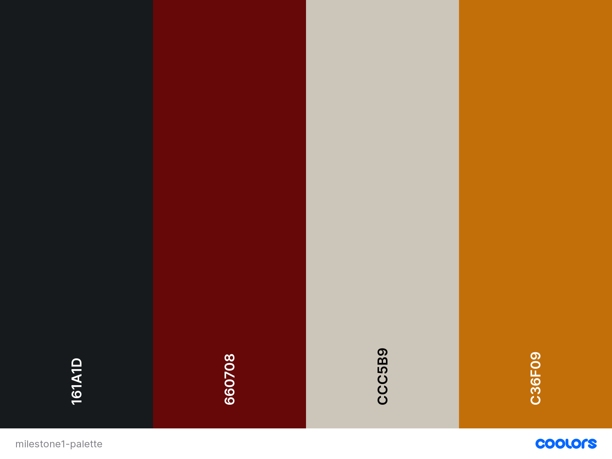

# Personal Portfolio

\
**Live Page**: https://zuhur.github.io/milestone-1/ \

**Milestone 1 project for Code institute Software Development Programme.** 

This website is a personal portfolio showcasing my personal information, work history, skills and projects to recruiters and potential employers. The website allows for impressed individuals and employers to make contact for job opportunities, freelance and project collaborations. 

## Table of contents
-   [UX](#ux)
    *   [Surface](#surface)
    *   [Scope](#scope)
    *   [Structure](#structure)
    *   [Skeletal](#skeletal)    
    *   [Surface](#surface)
-   [Features](#features)
    *   [Existing Features](#existing-features) 
    *   [Features left to Implement](#Features-Left-to-Implement)
-   [Technologies Used](#technologies-used)   
-   [Testing](#testing)
    *   [HTML Validation](#HTML-Validation)
    *   [CSS Validation](#CSS-Validation)
    *   [Responsiveness](#Responsiveness)
    *   [Manual Test](#Manual-Test)
-   [Deployment](#Deployment)
-   [Credits](#Credits)

## UX

### Strategy (#strategy)
The aim of this website is to showcase my skills for potential employers. By building a portfolio website I’ll have an online presence thus increasing my visibility to prospective employers and clients. 

### Scope
The first page is a simplistic yet eye catching telling the user the purpose of the page with only a glance. The user will be able to assess if the candidate is suitable only using website by showcasing the projects and skills. For further information links are provided such as resume for further professional evaluation and social media links for more personal evaluation.
 
### Structure 
The structure of the site is a single page application to prevent loading of pages and significantly reduce any waiting time. This will make it easy to quickly view and gather information from the site. Projects are displayed in noticeable way providing brief introduction and a link for further detail on the project. There are clickable icons provided along the site allowing user to be guided throughout the website, this prevents user getting distracted or lost browsing the site. The navigation links are placed in the header for ease of access while browsing different sections and are in a toggler icon for smaller devices. A noticeable resume button will be accessible through different screen sizes constantly available on the header and social media links available in the footer.

### Skeletal

#### Wireframes
The wireframes were designed using the balsamiq tool for different sections and screen sizes. These can be found below:
-   Front page
    *   [Desktop](assets/ms1-wireframes/Front-desktop.png)
    *   [Tablet/phone](assets/ms1-wireframes/Front-tablet_phone.png)
-	About section
    *   [Desktop](assets/ms1-wireframes/About-Desktop.png)
    *   [Tablet/phone](assets/ms1-wireframes/About-tablet_phone.png)
-	Projects section
    *   [Desktop](assets/ms1-wireframes/Project-Desktop.png)
    *   [Tablet/phone](assets/ms1-wireframes/Project-Tablet.png)
-	Contact section
    *   [Desktop](assets/ms1-wireframes/Contact-desktop.png)
    *   [Tablet/phone](assets/ms1-wireframes/contact-tablet.png)

### Surface

#### Colours
The main colours used are displayed below from [Coolors](https://coolors.co/) 

#### Fonts
Google fonts:
-   Karla
-   Ubuntu 

## Features

### Existing Features

#### Header
Navbar: Used bootstraps navbar for a responsive header. The header is transparent and fixed to the top of the page with my name as the nav logo.
For large screens navigation links are visible as:
*   About
*	Projects
*	Contact

There is also a resume button on the top right corner of the page that opens to a file in a new tab.
For medium and smaller screens, the navigation links and resume button are presented within a hamburger icon as.
*	About
*	Projects
*	Contact
*	Resume

#### Sections
Home: This section contains the main background image taking up full height and width of the page. A brief introduction is given as the header to the page and an inviting circular button at the bottom to take user to the next section. 

About: This section contains a personal introduction and icons/text to showcase skills. 

Projects: This section showcases five projects on large devices and four projects on devices smaller than large. On medium and smaller devices there is also a button directing to all the projects on a new tab.

Contact: This section contains a form to make contact for opportunities and includes required inputs:
*   Name
*   Email
*   Message

#### Footer
Footer: The footer contains nav links to social media pages and copyright information. There is also a vertical text in large devices when pressed goes back to home page and the text is changed to an icon for smaller devices.

### Features Left to Implement
#### Future
-   The projects section will get much bigger with more projects to come. Thus, the structure will change. With more projects the column and row features could be removed and also add a ‘more’ button to larger screens.
-	Also, the header nav links can clash with backgrounds and a feature which changes the colour when scrolling could be implemented. 

## Technologies Used

-	HTML5: For the structure of the site.
-	CSS3: For styling of the site.
-	Bootsrap5: For fast development of the site and its responsiveness.
-	Fontawesome: For visual icons.
-	Github: For remote access of the project.
-	Gitpod: Development environment on the browser.
-	Git: For version-control.
-	Visual Studio Code: A development environment as an upgrade to gitpod.
-	Balsamiq: For designing wireframes.
-	Google fonts: Styling of the text.
- Coolors: For selecting colour palette.

## Testing

### HTML Validation
The validator used was [https://jigsaw.w3.org/css-validator/](https://jigsaw.w3.org/css-validator/)
- It highlighted a stray end tag which was removed
-	No errors now remain

### CSS Validation
The CSS validator used was [https://jigsaw.w3.org/css-validator/validator]( https://jigsaw.w3.org/css-validator/validator)
-	No error shown

### Responsivness
Google devtools was used to make sure the site is responsive to different devices and screen sizes.

### Manual Test
#### Header
- All links were engaged to make sure they correspond to the right location.

#### Home
- The button on the front page correctly takes you the about page.

#### Projects
- Hovering over each project transforms correctly
- Clicking each page takes to the github page for further detail

#### Contact
- The form was submitted without any input - correctly prompted to fill in field
- Form was submitted with wrong input - promted to add using email format

## Deployment

#### Fork
1. Navigate to [repository](https://github.com/Zuhur/milestone-1)
2. Click fork in the top right corner.
Follow this link]( https://docs.github.com/en/github/getting-started-with-github/fork-a-repo) on how to fork a repository.

#### Clone Repository (Local copy)
1. Navigate to [repository](https://github.com/Zuhur/milestone-1).
2. Click Code located over the files.
3. Select how you want to create the local repo.
4. Copy the url.
5. Open Terminal.
6. Change directory to where you want the repo to be.
7. type "git clone" followed by the url copied in step 4.
8. Enter, and a Local repo is created.
Follow this [link](https://docs.github.com/en/github/creating-cloning-and-archiving-repositories/cloning-a-repository) on how to clone a repository.

#### Deploy
1.	Open this repository on Github [https://github.com/Zuhur/milestone-1]( https://github.com/Zuhur/milestone-1).
2.	Go to settings .
3.	Scroll down to GitHub Pages.
4.	Select a branch (master) and then /(root).
5.	Click save. 
6.	Link available when scrolled down to Github Pages.

## Credits

### Code used
Bootstrap 5 Docs: 
-	Navbar: [https://getbootstrap.com/docs/5.0/components/navbar/](https://getbootstrap.com/docs/5.0/components/navbar/)
-	Buttons: [https://getbootstrap.com/docs/5.0/components/buttons/](https://getbootstrap.com/docs/5.0/components/buttons/)
-	Display property: [https://getbootstrap.com/docs/4.5/utilities/display/](https://getbootstrap.com/docs/4.5/utilities/display/) 

CSS-TRICKS: 
-	Text-orientation: [https://css-tricks.com/almanac/properties/t/text-orientation/](https://css-tricks.com/almanac/properties/t/text-orientation/)
-	Flexbox: [https://css-tricks.com/snippets/css/a-guide-to-flexbox/](https://css-tricks.com/snippets/css/a-guide-to-flexbox/) 

W3school:
-	Transitions:  [https://www.w3schools.com/css/css3_transitions.asp](https://www.w3schools.com/css/css3_transitions.asp ) 
-	Transform Property: [https://www.w3schools.com/cssref/css3_pr_transform.asp](https://www.w3schools.com/cssref/css3_pr_transform.asp) 
-	Background position: [https://www.w3schools.com/cssref/pr_background-position.asp](https://www.w3schools.com/cssref/pr_background-position.asp) 

### Media
Image (from Pexels) by Negative Space:
-	 https://negativespace.co/illuminated-keyboard/ 

### Acknowledgements
I would like to thank my [mentor](https://github.com/deye9) for guiding me during the mentoring sessions on this project.

